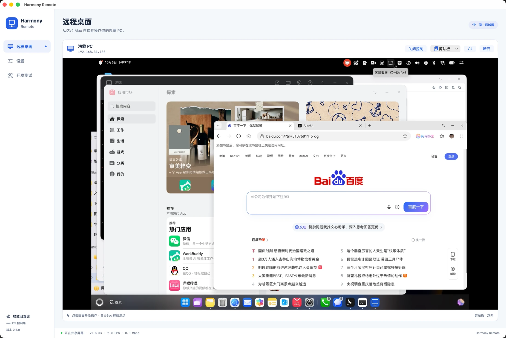
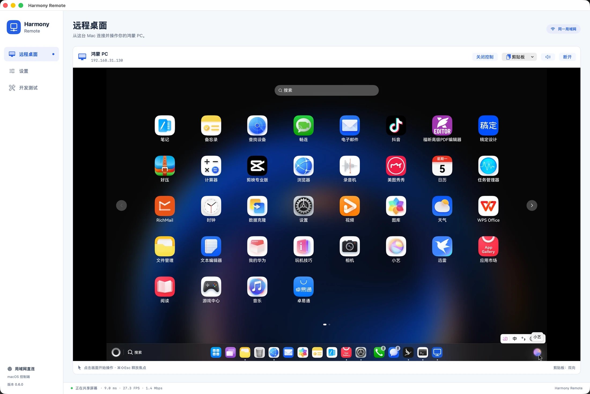
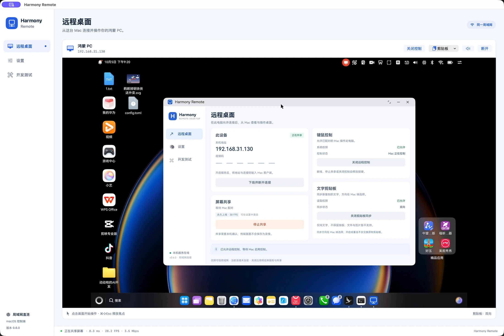
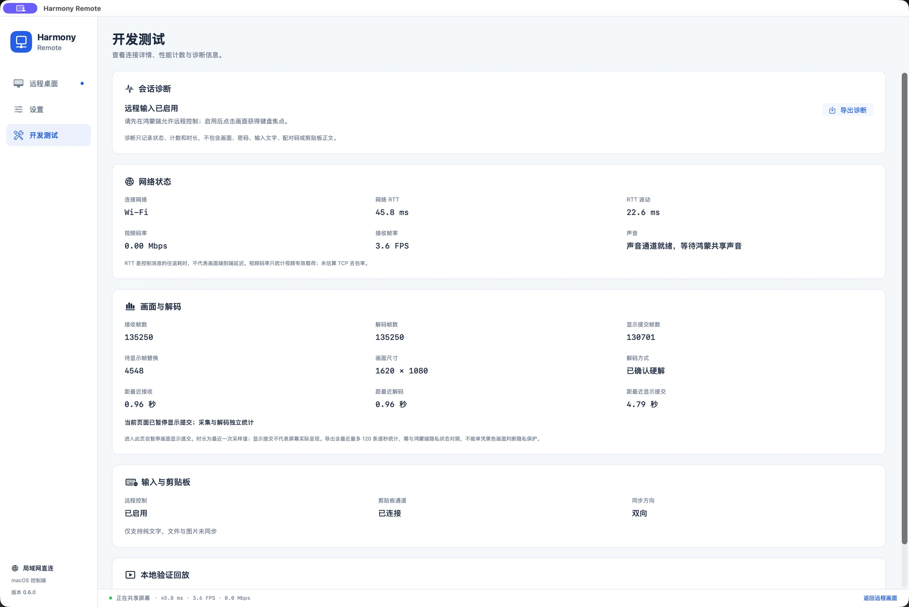

  

<h1 align="center">Harmony Remote</h1>

  <strong>通过任意设备远程控制你的鸿蒙电脑。</strong> 
  Designed by DDG

  
  
  
  

  <a href="#preview">产品预览</a> ·
  <a href="#progress">当前进展</a> ·
  <a href="#getting-started">开始使用</a> ·
  <a href="#roadmap">接下来</a> ·
  <a href="docs/PROTOCOL.md">协议文档</a>

  面向多设备的远程桌面，先从 Mac 与鸿蒙 PC 的连接开始。 
  <strong>当前支持：Apple Silicon Mac（macOS 14+）→ HarmonyOS PC（API 26），同一局域网。</strong> 
  “任意设备”是产品愿景；Windows、Linux、移动端与浏览器控制端尚未推出。

## 让鸿蒙电脑融入你的工作流

不用来回切换键盘和鼠标，在 Mac 上打开 Harmony Remote，就能查看鸿蒙电脑的桌面、操作应用、拖动窗口，并在两端复制纯文字。鸿蒙端决定何时共享、是否允许控制；Mac 端专注于远程操作。

- **原生画面链路**：鸿蒙屏幕采集与 H.264 硬件编码，Mac 使用 VideoToolbox 解码。
- **熟悉的桌面操作**：鼠标、键盘、右键菜单、窗口拖拽、文字拖选，以及 Mac 快捷键映射。
- **按需开启的协作能力**：文字剪贴板支持单向或双向；系统声音、帧率与连接偏好独立设置。
- **清楚的界面分工**：远程桌面、设置、开发测试分开，日常使用与故障排查各有入口。
- **自研应用层协议 HRD**：围绕鸿蒙远控设计会话、视频、输入、剪贴板与音频消息，协议与两端实现随源码公开。

## 产品预览

以下四张图片来自实际运行的 **0.6.0**，包含首屏大图。图片可点击查看；状态栏数值只是截图时的瞬时状态。

<table>
  <tr>
    <td width="50%">
      
      
<strong>你的鸿蒙应用，出现在 Mac 上</strong> 在远程画面中访问应用启动台，打开浏览器、文件管理和日常应用。

    </td>
    <td width="50%">
      
      
<strong>共享与控制，由鸿蒙端决定</strong> 连接信息、屏幕共享、键鼠授权与文字剪贴板集中在同一页面。

    </td>
  </tr>
</table>

### 看得见的连接状态

开发测试页展示接收、解码和显示提交的独立计数，以及网络 RTT、帧率、码率与各阶段最近活动时间。导出诊断不包含画面、密码、输入文字、配对码或剪贴板正文。

这张截图记录了 **135,250 帧累计接收 / 解码**，并显示硬件解码已启用。计数表示已经处理过的帧，不是内存中保留的图片数量。进入开发测试页会暂停隐藏画面的显示提交，接收与解码继续；因此这些数字不能直接当成丢帧、屏幕刷新或端到端延迟结论。

## 当前进展

**当前主线：0.6.0 开发预览版 · Host build 1000013 / Mac build 9**

更新于 **2026-10-05**。这些构建已在开发设备上安装运行；下表区分已观察到的效果、已实现但仍需验证的功能和后续计划。

| 能力 | 进展 | 当前范围 |
| --- | --- | --- |
| 局域网远程桌面 | 已有真机验证 | Mac 查看鸿蒙主屏；已有五分钟完整会话记录与当前长连接使用记录 |
| 键鼠控制 | 核心操作已验证 | 英文输入、右键、快捷键、窗口拖动、文字拖选；完整快捷键与异常释放矩阵继续补测 |
| 双向文字剪贴板 | 已实现，兼容性持续验证 | 关闭 / 单向 / 双向；单次最多 1 MiB UTF-8 纯文字，备忘录等应用的复制兼容性仍需回归 |
| 共享时长 | 已实现 | 10 分钟调试 / 永久在线；局域网共享不保存录像 |
| 断线重连与持久配对 | 已实现，待完整真机验收 | 身份校验、记住设备、撤销、有限时间内恢复；实际断网与系统重启场景待补测 |
| 30 / 60 FPS | 已实现，60 FPS 待实测 | 停止共享后选择，下次生效；目标帧率不等于恒定输出帧率 |
| 系统声音 → Mac | 已实现，待实机听感验收 | 独立音频通道、可静音，默认关闭；不采集麦克风 |
| 启动设置 | 已实现部分平台能力 | Mac 登录启动；鸿蒙可设置应用打开后开启服务，系统开机自启受平台接口限制 |
| 网络与解码诊断 | 已在运行中使用 | 网络 RTT / 波动、码率、接收 FPS、分段帧数与活动时间 |
| 密码场景窗口遮挡 | AionUI 网页已复测 | 网页被保护时，窗口外桌面正常；点击其他区域后网页恢复；其他应用及系统弹窗尚未验收 |
| 文件传输 / 文件复制粘贴 | 规划中 | 当前剪贴板仅支持纯文字，尚不能传文件或图片 |
| 更多设备 / 跨公网连接 | 规划中 | 当前只有 Mac 控制端与可信局域网连接 |

本次 Mac 长连接资源检查中，运行约 80 分钟后进行的短时采样出现峰值回落，未见持续单向上涨；这不替代 8～24 小时稳定性验收。应用限制解码在途任务、待显示帧及诊断历史数量，不按累计帧数保存整场视频。

历次构建与验收详见 [版本记录](docs/VERSION_HISTORY.md)、[0.6.0 候选验收](docs/V0_6_0_ACCEPTANCE.md) 和 [隐私场景接口审计](docs/PRIVACY_CAPTURE_AUDIT.md)。历史文档按当时的构建保留，当前主线状态以上表为准。

## 开始使用

目前通过源码构建体验，**尚未发布可直接下载的通用安装包**。鸿蒙端需要为自己的设备配置签名，Mac 构建面向 Apple Silicon。完整步骤见 [构建与安装](docs/BUILDING.md)。

装好两端后：

1. **鸿蒙端开启服务**，在页面查看本机地址和连接码。
2. **Mac 连接设备**，输入地址和连接码；需要持久配对时，按两端设置允许并记住设备。
3. **鸿蒙端开始共享屏幕**，在系统弹窗中确认共享范围。
4. 需要操作时，在鸿蒙端授权并允许键鼠控制，再在 Mac **启用键鼠控制**、点击画面获得焦点。剪贴板同步也需两端按需开启。

> 当前使用**未加密的局域网传输**，请只在可信局域网体验。设备身份签名用于认证，不等于媒体和输入内容已经加密。共享与输入权限仍由鸿蒙本机控制。

## 自研应用层远程桌面协议 HRD

Harmony Remote 自行定义并实现应用层消息格式与会话流程，分别承载控制、视频、键鼠、剪贴板和音频。当前产品构建未使用 RustDesk SDK，也未基于 RDP、VNC 或 WebRTC 协议实现。

| 项目自行设计实现 | 采用的标准与系统能力 |
| --- | --- |
| 控制握手、会话状态、能力协商与心跳 | TCP/IP、JSON 与系统网络框架 |
| `HRD1` 视频封包、序号、CONFIG / IDR / EOS 规则 | 标准 H.264 Annex-B、鸿蒙硬编、Mac VideoToolbox |
| 键鼠事件映射、剪贴板版本与应用确认 | 鸿蒙输入注入、平台剪贴板 API |
| `HRDA` 音频封包、通道绑定与有界缓冲 | PCM、鸿蒙系统声音采集、Mac 音频框架 |
| 配对挑战、设备信任与重连流程 | 标准 P-256 签名、HUKS、macOS Keychain / CryptoKit |

这里的“自研”指**应用层协议及其实现**，并不表示自行发明 TCP/IP、视频编码或密码算法。

进一步了解：[主协议](docs/PROTOCOL.md) · [配对与重连](docs/SESSION_RELIABILITY.md) · [剪贴板协议](docs/CLIPBOARD_WIRE.md) · [音频与帧率](docs/MEDIA_AUDIO_FPS.md)

## 接下来

按“小步交付、真实设备验证”推进。以下是开发方向，不是已支持的功能或确定发布日期。

| 阶段 | 计划 |
| --- | --- |
| **把当前体验做稳** | 完成剪贴板应用兼容性回归、真实断网与重启配对、60 FPS / 音频 / 启动验证，以及 8～24 小时资源与恢复测试 |
| **把文件带过去** | 双向文件传输、进度与取消、失败恢复，再扩展文件复制粘贴与拖放；不把系统内的文件拖动等同于跨设备传输 |
| **让连接更完整** | 加密传输、设备发现、连接状态与错误提示、经过验证的发行安装包与更新流程 |
| **走向更多设备** | 探索 Windows / Linux 控制端，再评估移动端与浏览器；跨公网访问在加密与认证完善之后推进 |

## 开发与反馈

发现问题或有想法，欢迎提交 [Issue](https://github.com/longxinzhang/harmony-remote-desktop/issues)。请附上两端版本、系统版本、复现步骤，以及去除敏感信息的诊断；不要上传真实密码、配对码或私人桌面内容。

| 文档 | 内容 |
| --- | --- |
| [构建与安装](docs/BUILDING.md) | 开发环境、源码构建、签名与首次连接 |
| [测试入口](docs/TESTING.md) | 录屏、输入与真机验证流程 |
| [会话可靠性](docs/SESSION_RELIABILITY.md) | 配对、撤销、重连与释放机制 |
| [平台能力](docs/PLATFORM_CAPABILITIES.md) | 权限与 HarmonyOS 能力边界 |
| [版本来源](docs/VERSION_HISTORY.md) | 历史代码、标签和验证记录 |

仓库目前尚未添加 `LICENSE` 文件，许可方案待明确。产品交互参考了 [RustDesk](https://github.com/rustdesk/rustdesk) 等远程桌面工具；Harmony Remote 是独立项目，与华为、RustDesk 无官方关联。

---

<strong>Harmony Remote</strong> Designed by DDG

